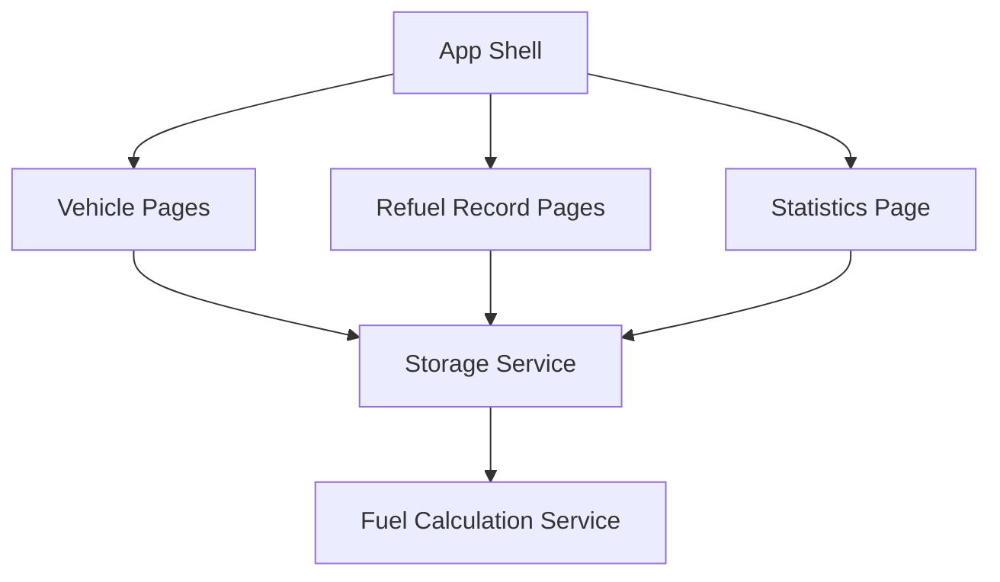

# Fuel Consumption Mini Program

Feature Name: fuel-consumption-mini-program
Updated: 2026-06-01

## Description

本设计面向一个从零开始的微信小程序项目，目标是在最小可用版本中完成车辆管理、加油记录、油耗计算与基础统计展示。首版方案采用本地存储作为数据源，优先保证单用户、单设备上的离线可用性和实现速度。

## Architecture



架构采用微信小程序前端单体结构：页面层负责交互，存储服务负责读写本地数据，计算服务负责派生油耗与统计结果。

## Components and Interfaces

### 1. App Shell

- 职责：初始化小程序、加载全局状态、维护当前选中的 Vehicle。
- 接口：`loadAppState()`、`setCurrentVehicle(vehicleId)`。

### 2. Vehicle Pages

- 页面：车辆列表页、车辆编辑页。
- 职责：创建、编辑、切换 Vehicle。
- 输入：车辆基础信息。
- 输出：更新后的车辆列表与当前车辆标识。

### 3. Refuel Record Pages

- 页面：记录列表页、记录编辑页、记录详情弹层或详情页。
- 职责：录入、展示、编辑加油记录，触发重算。
- 输入：日期、里程、加油量、金额、是否加满。
- 输出：排序后的记录列表与每条记录的派生计算结果。

### 4. Statistics Page

- 职责：展示累计指标和趋势数据。
- 输入：当前 Vehicle 的已计算记录。
- 输出：累计里程、累计加油量、平均油耗、累计油费、趋势序列。

### 5. Storage Service

- 职责：封装微信小程序 `wx.setStorageSync` 与 `wx.getStorageSync`。
- 建议接口：`getVehicles()`、`saveVehicles(vehicles)`、`getCurrentVehicleId()`、`saveCurrentVehicleId(vehicleId)`。

### 6. Fuel Calculation Service

- 职责：根据记录序列生成阶段油耗与统计结果。
- 建议接口：`recalculateVehicle(vehicle)`。
- 核心规则：按时间正序处理记录，仅在满足可计算条件时生成阶段结果。

## Data Models

### Vehicle

```ts
type Vehicle = {
  id: string
  name: string
  plateNote: string
  fuelType: string
  tankCapacity: number | null
  records: RefuelRecord[]
}
```

### RefuelRecord

```ts
type RefuelRecord = {
  id: string
  date: string
  odometerKm: number
  fuelLiters: number
  totalCost: number
  isFullTank: boolean
  segment?: {
    distanceKm: number
    fuelLiters: number
    fuelPer100Km: number
    costPer100Km: number
  }
}
```

### AppState

```ts
type AppState = {
  currentVehicleId: string | null
  vehicles: Vehicle[]
}
```

## Correctness Properties

1. 同一 Vehicle 下的记录在计算前必须按日期和录入顺序稳定排序。
2. 任意一条 Refuel Record 的 `odometerKm` 必须大于前一条记录的 `odometerKm`。
3. `fuelLiters` 与 `totalCost` 必须为大于 0 的数值。
4. 统计页展示的累计数据必须来自最新一次重算结果。

## Error Handling

1. 表单校验失败时，页面直接标注错误字段并保留当前输入内容。
2. 本地存储读取失败时，展示初始化提示，并允许用户重新创建空数据集。
3. 重算过程中遇到异常数据时，将对应记录标记为不可计算，并提示用户检查记录连续性。

## Test Strategy

1. 单元测试覆盖计算服务，包括首条记录、连续满油记录、编辑历史记录后的重算。
2. 页面测试覆盖车辆创建、记录新增、统计展示与异常提示。
3. 手工验收覆盖微信开发者工具中的完整录入流程和应用重启后的数据恢复。

## Implementation Notes

1. 技术栈建议使用微信原生小程序或 Taro；如果目标是尽快上线，优先微信原生小程序。
2. 首版页面建议控制在 4 个核心页面：车辆页、记录列表页、记录编辑页、统计页。
3. 若后续增加云同步，可在 Storage Service 之上增加 Repository 抽象层。
